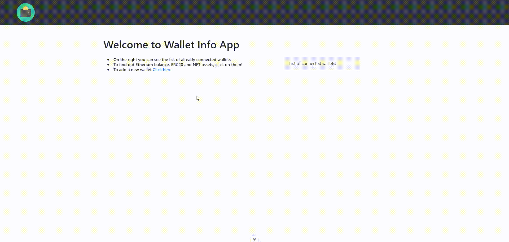

# Wallet Info App

A simple pet project - full-stack app for viewing your wallet's Etherium balance and ERC20 and NFT token assets

backend - Django
frontend - Vue

Guide on installing and running backend and frontend parts of the app is in 
the readme.md in corresponding folders.

Example of usage:

